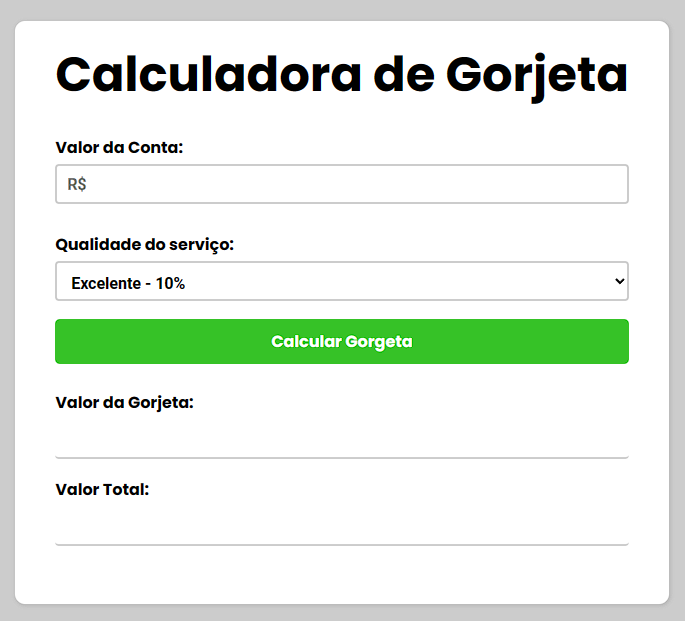

  

## Projeto Calculadora de Gorjeta - 🤑
Projeto Calculadora de Gorjeta totalmente responsivo, consiste em pegar um valor que o usuário digita e converte a gorjeta perante a escolha do serviço "excelente, ótimo etc...". Projeto feito para Treinar HTML CSS e JavaScript.

## Tecnologias - 👨‍💻
- HTML 
- CSS
- JavaScript
- Git e Github